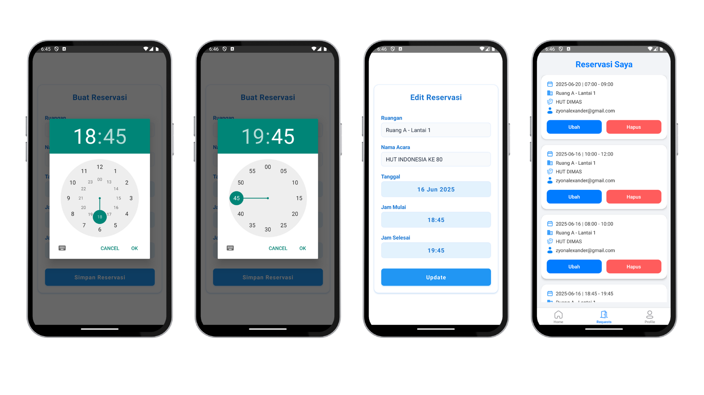

# RuangKita – Aplikasi Pemesanan Ruangan

RuangKita adalah aplikasi mobile berbasis React Native yang digunakan untuk memudahkan pengguna dalam melakukan pemesanan ruangan meeting.


## Documentation




## Cara Menjalankan Aplikasi

### 1. Clone Repository

```bash
  git clone https://github.com/dimasfauziann/RuangKita.git
```

### 2. Install Dependencies

```bash
  npm install
```

### 3. Jalankan Metro Server

```bash
  npm start
```

### 4. Jalankan Aplikasi di Emulator/Device

#### - Android:

```bash
  npx react-native run-android
```
#### - ios:

```bash
  npx react-native run-ios
```


## Fitur Aplikasi
- Login dengan validasi Formik + Yup

- Home: Menampilkan daftar ruangan dan slot waktu tersedia

- Request: Buat permintaan pemesanan ruangan

- Profile: Menampilkan data pengguna dan tombol logout

- Notifikasi: Reminder meeting 10 menit sebelum jadwal

- Bottom Tab Navigation untuk navigasi antar halaman

- Penyimpanan data pengguna dengan AsyncStorage


## Fitur Aplikasi
#### untuk pengembangkan aplikasi ini lebih lanjut:
- Fork repositori ini

- Buat branch fitur: 
```bash
  git checkout -b fitur-nama
```
- Commit: 
```bash
  git commit -m "Tambah fitur ..."
```
- Push ke branch: 
```bash
  git push origin fitur-nama
```
- Pull Request


